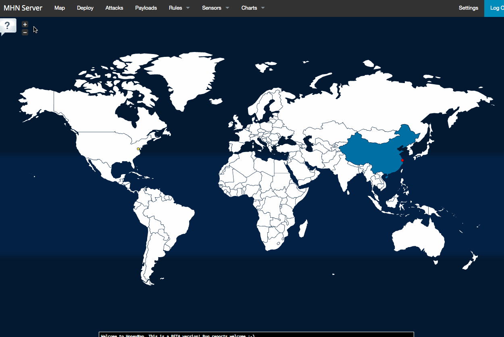

# Week 10 - Honeypot

## Honeypots Deployed

- Dionaea

## Issues Encountered

The most prominent hurdles faced is identifying when to run a new terminal and which host to run it under. This involved repitition of previous steps such as configuring ssh again to gain access to the proper VM instance. The initial stagnations that emerged from this inconvenience were all dwarved compared to the prevailing frustration caused by exporting and copying the database. The start of this frustration was first caused by the existence of two VM instances in my project compute engines. When setting up ssh with gcloud it would always target the extraneous instance which didn't have a server created. It is unsure how this instance was formed but the situation was resolved by deleting it manually in the gcloud platform. This allowed access to the server with the active honeypot which contains the database for the attacks that have been ensuing the several hours of trying to understand why the sensor data wouldn't export. Before that the mongoexport command would result in an error due to reachable servers, which makes sense because it didn't exist, the terminal was in the wrong VM instance. Another important finding from this vile error was that mongoexport won't even run until MHN-Admin was installed. And the instances are only detected when ssh is setup. 

When the correct instance is finally active in the terminal the mongoexport command ran so pleasantly smooth. However, the victory was short lived as there wasn't the slightest notion on how to go about copying the database on the host machine. This took several attempts and rearrangements of the session file and the scp command line. The final result a simple editting in the path of the source file and moving the session file to the convenient location based on the scp command line.

## Attack Summary:

**Attacks in the last 24 hours:** 7,469

**TOP 5 Attacker IPs:**
 
 49.229.29.50 (935 attacks)
 
 213.192.86.195 (909 attacks)
 
 185.232.65.30 (374 attacks)
 
 220.136.206.154 (320 attacks)
 
 195.154.133.163 (300 attacks)

**TOP 5 Attacked ports:**

445 (1,666 times)

8088 (1,057 times)

5555 (939 times)

8050 (657 times)

1433 (333 times)

TO**P 5 Honey Pots:** dionaea (7,469 attacks)

## Unresolved Questions

Why are some IP's attacking so repeatedly, what could be the motive for it? Certian IP's didn't have flags, is that because of the location being in internation waters? What is the significance of the ports, are they like the zipcode of IP adresses?
