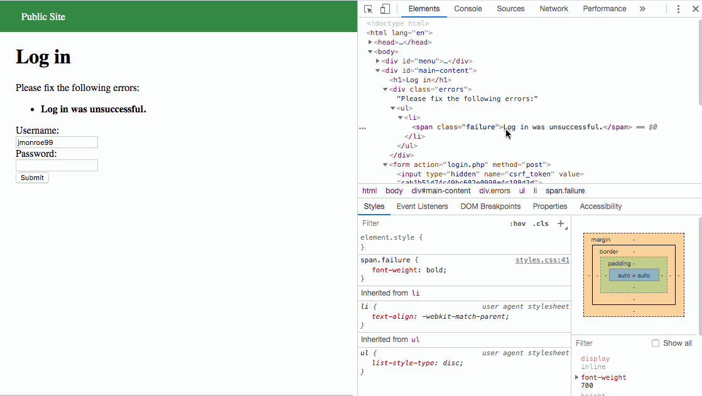
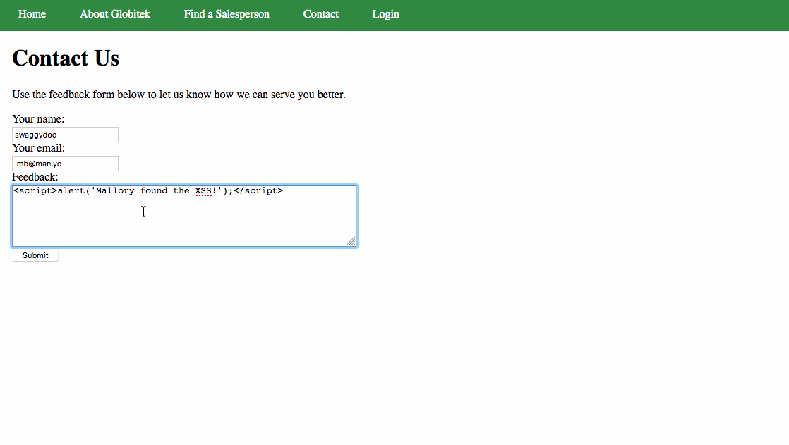

# Week 09 - Pentesting Live Targets

Time spent: **X** hours spent in total

> Objective: Identify vulnerabilities in three different versions of the Globitek website: blue, green, and red.

The six possible exploits are:

* Username Enumeration
* Insecure Direct Object Reference (IDOR)
* SQL Injection (SQLi)
* Cross-Site Scripting (XSS)
* Cross-Site Request Forgery (CSRF)
* Session Hijacking/Fixation

Each color is vulnerable to only 2 of the 6 possible exploits. First discover which color has the specific vulnerability, then write a short description of how to exploit it, and finally demonstrate it using screenshots compiled into a GIF.

## Blue

Vulnerability #1: Session Hijack

Description:

This attack took advantage of the PHP script that was left, and deployed a session hijack. A browser in google chrome was used to log in to a session. The PHP script was then loaded to gain access to the session ID. Then burp intercepted the login page of the site on a Firefox browser. There the session ID was changed to that of the logged in ID from the google browser and forwarded back to Firefox. The result was a successful log in using the hijacked session ID.

Vulnerability #2: SQLI

Description: When editing the URL id number for the salesperson changin the number shows the respective representative. This is done fairly instantaneously. However, when the following SQL line is placed in the value for the id, the server takes several seconds to load, indicating it registers the command and can be infiltrated with other injections. 

>%27%20OR%20SLEEP(5)=0--%27

## Green

Vulnerability #1: Username Enumeration

Description: When a valid username is used to log but is unsuccessful due to incorrect password, the login fail text is bold, whereas with an invalid username the font is regular. This can be inspected in the style statement from the text is a css class called .failure which is displayed when a valid username is used.

Vulnerability #2: XSS

Description: In the contact company section, putting in any name and valid email structure allows for a message to be sent. An xss script can then be sent and tested on the page. When a user logs in and checks the feed back and message box should appear with the written text. 

## Red

Vulnerability #1: IDOR

Description:

After clicking on a representative in the Find a Salesperson menu, the URL will end in an id repsective to a representative. If the id is changed to 11 it will show data that would seem inappropriate for the public to access. The other color sites are protected from this vulnerability.

Vulnerability #2: 

Description:

## Notes

It can become very overwhelming to see which vulnerability is present in what respective color. This is especially so in the beginning when it is hard to determine where to even start.
